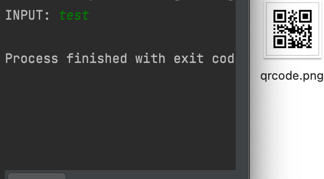

# QRGENERATOR
A simple application that generates a QR code from the given input. Just run the script, enter the text you want to turn into a QR code and click Enter. The result will be in the file named "qrcode.png".<br/>
<br/>


# Installation
You will need these packages in order to run QRGENERATOR:
* qrcode
* pillow

You can install them by running:
```
pip install -r requirements.txt
```
# Usage
1. Run QRGENERATOR
2. Input link/text you want to turn into QR code and click enter
3. Generated QR code will be in the script location location

# Author
Filip Rokita<br/>
www.filiprokita.com
